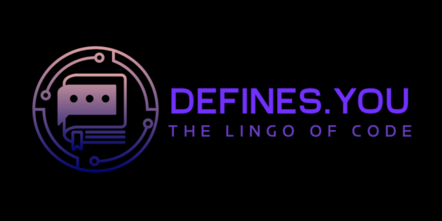

# Technical Terms Vocabulary for Desktop

 by [Chris Khomo](https://github.com/cskhomo) & [Thero Thethe](https://github.com/thero-sgit)

## Table of Contents

- [Summary](#summary)
- [Analysis](#analysis)
	- [Data Storage](#data-storage)
	- [Online Definitions](#online-definitions)
	- [User-Interface](#user-interface)

## Summary

New developers often struggle with programming terminology, feeling lost when they encounter words like "polymorphism" or "concatenation" 

_Defines_ offers a simple, beginner-friendly solution by providing clear and concise definitions of these terms. It serves as an easy-to-use lookup tool, helping beginners quickly understand technical jargon. Accessible anywhere, even offline, ensuring that learners can get the help they need, anytime, without getting stuck.

## 
Analysis

### Data Storage

The program will store a collection of commonly used technical terms on the user's local machine. These can be viewed offline, providing quick access to essential definitions. Additionally, for every term that the user has looked at in the past, the program will store that term within a long-term offline cache. This way, the user can access popular and previously viewed terms even without an internet connection.

### Online Definitions

When the user searches for a term that is not stored locally, the program will connect to an external online source to retrieve the definition. This ensures that the user has access to a comprehensive dictionary of technical terms, even if the term is not part of the local collection.

### User-Interface

The program will feature a minimalist and intuitive interface, presenting a list of technical terms in alphabetical order. Users may locate specific terms by scrolling through the list or by using the search function.